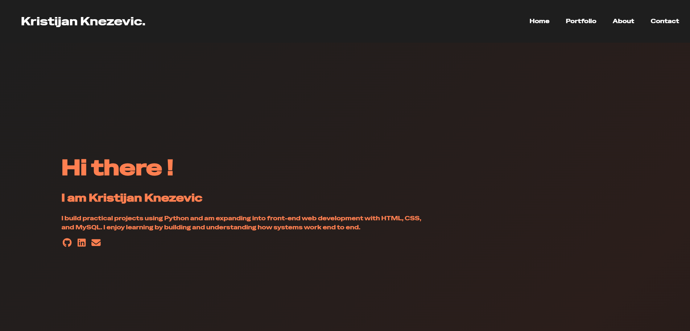
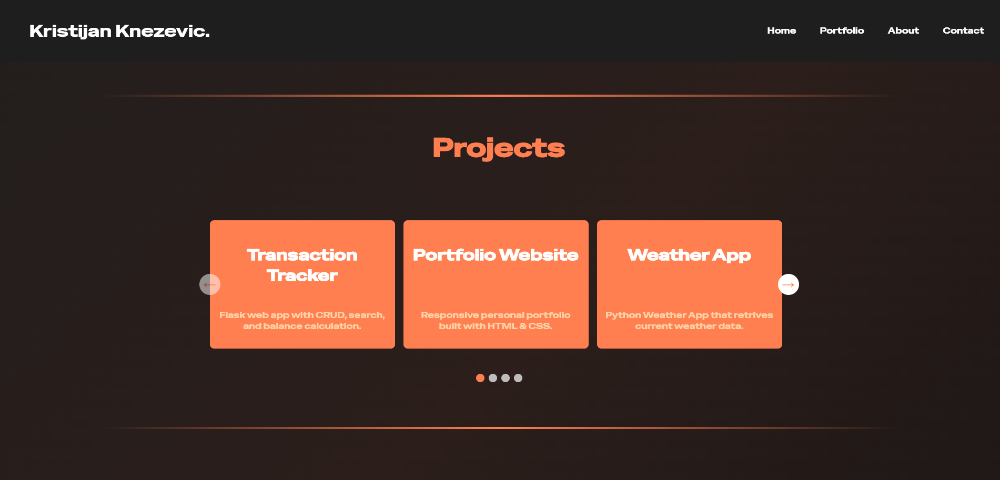
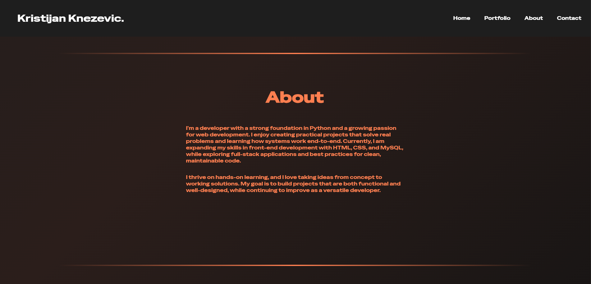
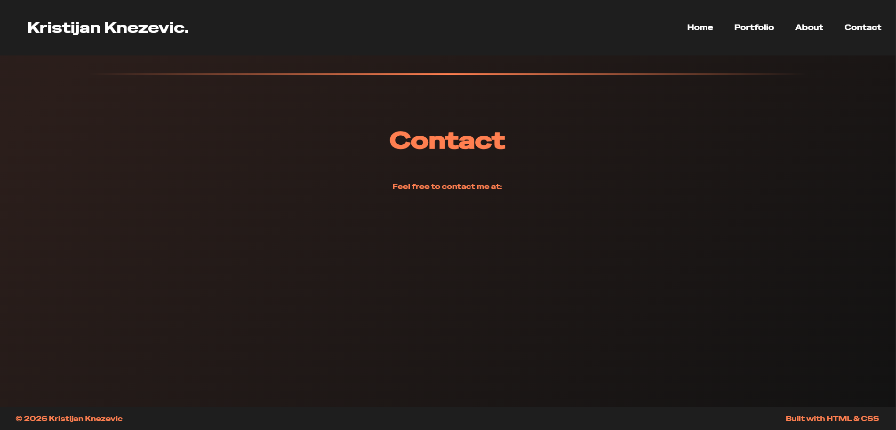

# 🌐 Portfolio Website

This is my personal portfolio website where I showcase my projects, skills, and ongoing work in web development.

The website is now **live on GitHub Pages** with a custom domain:

👉 **https://www.kristijanknezevic.org**

---

## 🚀 Project Overview

This project started as a locally developed website and has since been deployed publicly.  
The screenshots below show earlier development stages when the site was running on `localhost`.

---

## 📸 Development Preview






---

## 🛠 Tech Stack

- HTML  
- CSS  
- GitHub Pages (hosting & deployment)

---

## 📌 Current Status

✅ Website deployed and live  
🚧 Continuous improvements, styling updates, and additional content planned

---

## 💻 Running Locally

If you'd like to run the project locally:

```bash
git clone https://github.com/YOUR-USERNAME/YOUR-REPOSITORY.git
